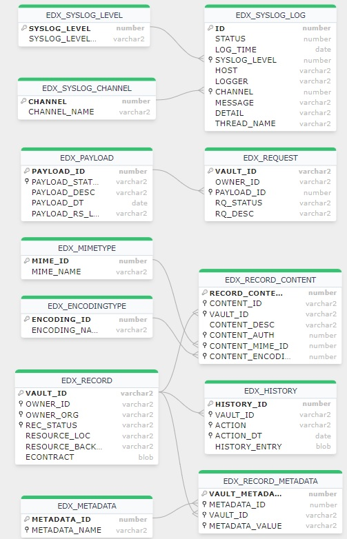

## EDX Vault

Oracle DDL and Entity-Relationship Diagram for EDX Vault, a secured and controlled repository for storage, administration, servicing, transfer and termination of authoritative electronic contracts. 

